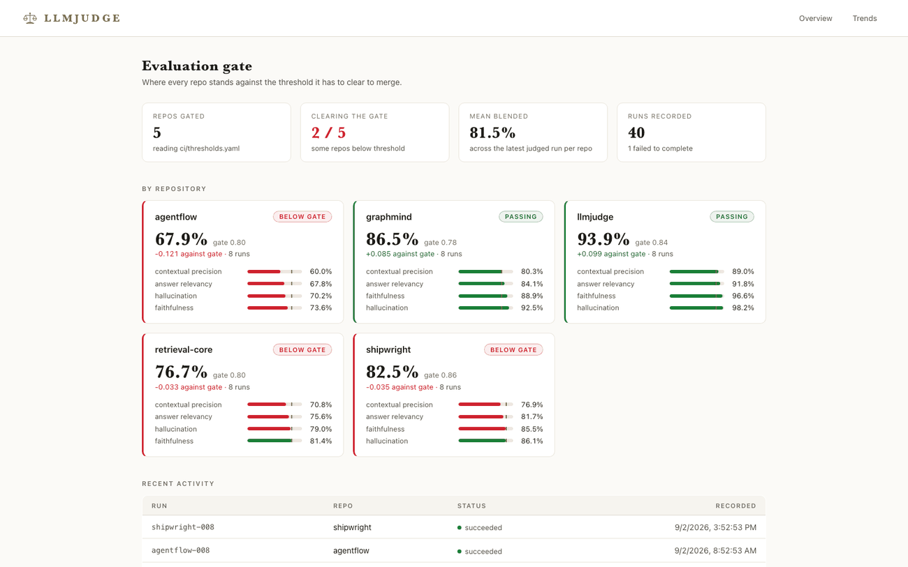
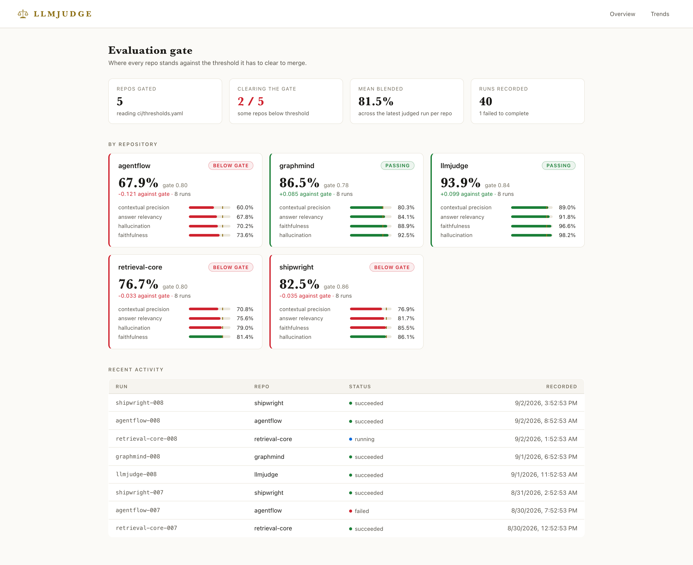
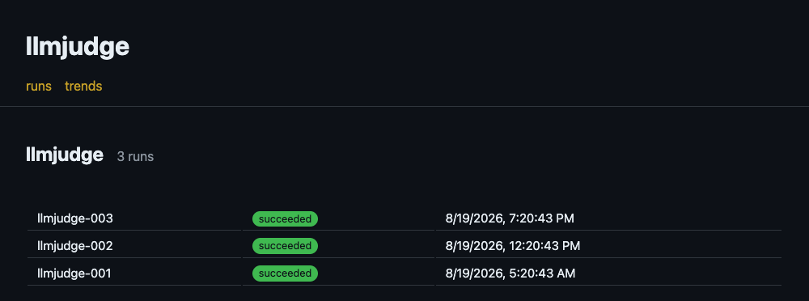
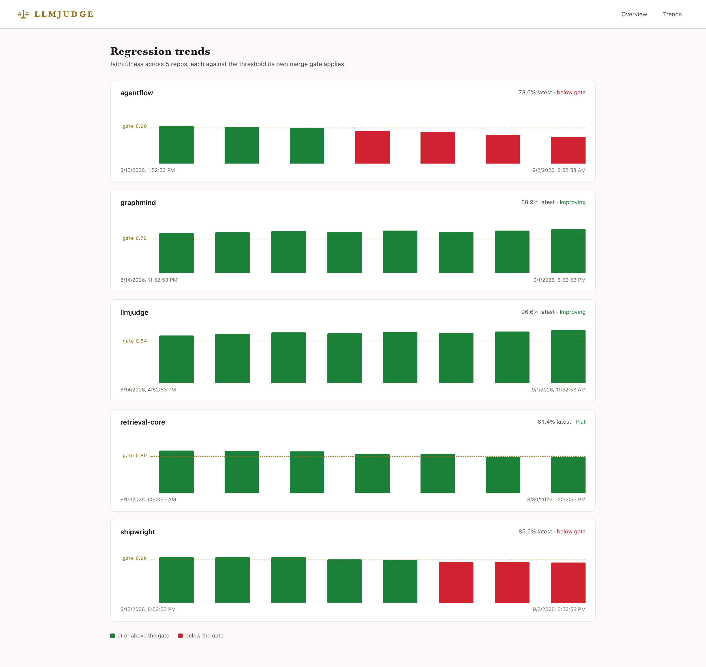

<div align="center">


[](pyproject.toml)
[](api/)
[](store/)
[](jobs/)
[](dashboard/package.json)
[](dashboard/package.json)
[](docker/)
[](LICENSE.md)

Llmjudge is a self-hosted LLM evaluation service that runs a frozen eval
suite against every pull request and blocks the merge when a repo's blended score falls
below the threshold it has to clear, with no scores, prompts, or datasets leaving your
own infrastructure.



</div>

## Why llmjudge

A prompt or model change can silently degrade answer quality in ways unit tests
never catch. llmjudge runs a frozen eval suite against every PR — the same way
pytest gates code changes — and blocks the merge when a gated metric regresses
past the repo's threshold. Everything runs on your own infrastructure: no
scores, datasets, or prompts leave your network.

## Feature overview

- **Metric library** (`metrics/`) — faithfulness, answer relevancy, contextual
  precision/recall, hallucination detection, and agent-trajectory scoring for
  multi-hop agent runs. Every metric implements the shared `BaseMetric`
  interface (`metrics/base.py`): stable name, threshold, and a normalized
  score in `[0, 1]`.
- **G-Eval judge ensemble** (`metrics/g_eval.py`) — three judge models from
  different families score each case against versioned rubric templates
  (`metrics/rubric_templates/`). Disagreement past a spread threshold is
  flagged for human review rather than averaged away, after we measured a
  +0.15 average self-preference score inflation with a single judge.
- **Rubric calibration** (`calibration/`) — judge scores are calibrated against
  a human-labeled gold set (agreement rate, Cohen's kappa, MAE, suggested
  thresholds) before any rubric or threshold change ships.
- **Synthetic dataset generator** (`data/`) — generates QA and RAG eval cases
  from prompt templates, with provenance tagging and separate storage buckets
  so real production queries can never leak into the synthetic gold set.
- **CI merge-gate** (`ci/`, `.github/workflows/`) — polls eval runs and fails
  closed: a gate that cannot observe its run blocks the merge instead of
  silently passing. Thresholds are configured per repo in `ci/thresholds.yaml`.
- **Red-team safety pack** (`safety/`) — toxicity and prompt-injection
  resistance probes (instruction override, persona jailbreaks, encoding
  tricks, indirect context poisoning, exfiltration), scored as pack resistance.
- **Results API** (`api/`) — FastAPI service over the Postgres results store:
  runs, scores, per-metric history, and run-to-run comparison endpoints.
- **Dashboard** (`dashboard/`) — Next.js app showing every repo against the
  threshold its own merge gate applies, with per-repo drill-downs and
  regression trend charts.

  

  Each card carries the blended score, the gate it has to clear, and the
  per-metric bars behind it, so a repo that has slipped reads as such at a
  glance. Drilling in shows which run it started slipping on:

  

  Trends chart one metric per repo against that repo's own threshold, rather
  than a single number applied to everything:

  
- **Job queue** (`jobs/`) — arq/Redis worker fleet with exponential-backoff
  retries, dead-lettering, and queue-depth autoscaling.

## Quickstart (one command, fully dockerized)

```bash
cp .env.example .env
docker compose -f docker/docker-compose.yml up --build
# dashboard on :3000, api on :8000, postgres on :5432, redis on :6379
```

The compose stack boots the FastAPI API, the arq worker, the dashboard,
Postgres, and Redis together — no local installs required.

To run the eval suite once the stack is up:

```bash
docker compose -f docker/docker-compose.yml exec api pytest harness/
```

## Architecture

```
llmjudge/
├── harness/                # LLMTestCase data model + pytest-style eval runner
├── metrics/                # BaseMetric + all metric implementations + rubrics
├── safety/                 # red-team safety packs (toxicity, injection)
├── api/                    # FastAPI results API (routes/, deps)
├── store/                  # Postgres results store, dataset versioning + S3
├── jobs/                   # arq worker, retry policy, autoscaling
├── config/                 # per-repo eval config schema + loader
├── calibration/            # gold-set calibration utilities
├── data/                   # synthetic dataset generator + templates
├── ci/                     # merge gate, thresholds, audit filter
├── dashboard/              # Next.js dashboard (app/, components/, lib/, e2e/)
├── docker/                 # one Dockerfile per service + docker-compose.yml
├── scripts/                # demo server: the API over a seeded in-memory store
├── docs/adr/               # architecture decision records
└── tests/                  # unit / integration / golden (mirrors the source tree)
```

Data flow: an eval run is enqueued (`jobs/arq_worker.py`) → the runner scores
every case with the configured metrics (`harness/runner.py`) → scores persist
to Postgres (`store/results_store.py`) with optimistic locking → the merge
gate compares them against `ci/thresholds.yaml` → the API and dashboard render
runs, trends, and comparisons.

## Configuration

| File | Purpose |
|---|---|
| `.env` | Connection strings and secrets (`DATABASE_URL`, `REDIS_URL`, `JUDGE_MODEL`, `LLMJUDGE_API_URL`, `S3_BUCKET`). Never committed — copy from `.env.example`. |
| `llmjudge.example.yaml` | Per-repo eval config: which dataset and metrics each repo runs, with optional threshold overrides. |
| `ci/thresholds.yaml` | Merge-gate thresholds per repo (blended score floor; repos without an entry inherit `default_threshold`). |
| `config/autoscaling.yaml` | Worker fleet autoscaling policy (min/max workers, scale-up depth, cooldown). |
| `metrics/rubric_templates/*.yaml` | Versioned per-metric judging rubrics. |

Environment overrides: `LLMJUDGE_CONFIG` (eval config path),
`LLMJUDGE_THRESHOLDS` (threshold config path), `LLMJUDGE_API_URL` (gate target).

## Using the merge gate in another repo

1. Deploy the stack (above) and set `LLMJUDGE_API_URL` as a secret in the
   consuming repo.
2. Copy `.github/workflows/ci.yml`'s `merge-gate` job into the consuming
   repo's workflow (or call `python ci/merge_gate.py --repo <name>` from any
   existing job).
3. Add the repo to `ci/thresholds.yaml` with its score floor.

The gate waits for the eval run, compares blended scores against the repo's
threshold, and exits non-zero on any regression — or on timeout, by design
(fail closed).

## Development

```bash
python3.12 -m venv .venv && source .venv/bin/activate
pip install -e .[dev]
pytest tests/                       # unit + integration + golden
ruff check . && ruff format --check .
mypy --strict harness metrics safety jobs api config calibration ci store data
```

Dashboard:

```bash
npm install --prefix dashboard
npm run dev --prefix dashboard      # http://localhost:3000
npm run typecheck --prefix dashboard
npm run test:e2e --prefix dashboard # Playwright (needs the stack running)
```

Pre-commit hooks (Ruff, mypy, Prettier) run the same checks as CI:
`pre-commit install`.

## Documentation

- `docs/adr/ADR-001-evaluation-metric-design.md` — metric interface contract,
  score normalization, prompt versioning, and the move to the 3-judge ensemble.
- `CONTRIBUTING.md` — coding standards, git workflow, and the pre-merge checklist.
- Open issues track known gaps (multi-turn injection cases, per-metric gate
  thresholds, multi-modal scoring).

## License

[MIT](LICENSE.md) © [abj360](https://github.com/abj360) and contributors.
